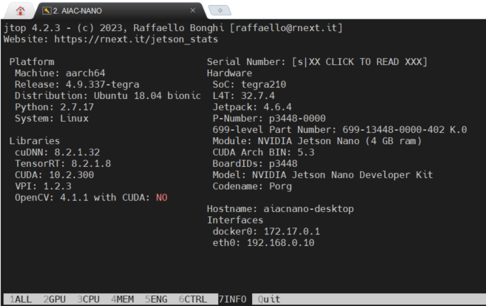

# JetsonNano2024

Jetson Nano AI - AI on EDGE Computing

- 날짜: 2024년 2월 5일
- 시간: 오후 1시 - 5시 (4시간)


### Nano에 PyCUDA 설치하기
  
In a .bashrc file
```
   export PATH="/usr/local/cuda-10.2/bin:$PATH"
   export LD_LIBRARY_PATH="/usr/local/cuda-10.2/lib64:$LD_LIBRARY_PATH"

   export CPATH=$CPATH:/usr/local/cuda-10.2/targets/aarch64-linux/include
   export LIBRARY_PATH=$LIBRARY_PATH:/usr/local/cuda-10.2/targets/aarch64-linux/lib

```
.bashrc file 수정후 ```source .bashrc``` 를 수행

### 설치

```
pip3 install pycuda --user
```


### Jetson Nano 설정 상황


